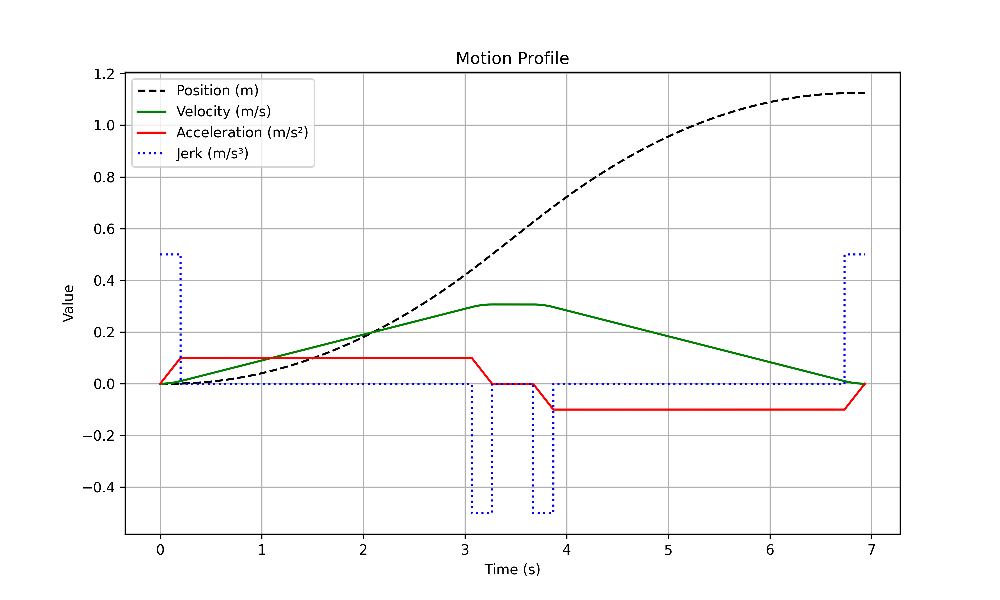

# Velocity Profile
Compile:
```
>> gcc main.c -o main.a -std=c99
```

Run:

```
>> ./main.a 1 0.2 1 1    
Displacement is 1.000000 
Velocity is     0.200000
Acceleration is 1.000000
Jerk is         1.000000

Time  0: 0.447214
Time  1: 0.000000
Time  2: 0.447214
Time  3: 3.321478
Time  4: 0.447214
Time  5: 0.000000
Time  6: 0.447214

Total time is 5.110332
```

Bugs when a_max is small:

```
>> ./main.a 1 0.2 0.45 1        
Displacement is 1.000000
Velocity is     0.200000
Acceleration is 0.450000 
Jerk is         1.000000

Time  0: 0.447214
Time  1: 0.000000
Time  2: 0.447214
Time  3: 658.934570
Time  4: 0.447214
Time  5: 0.000000
Time  6: 0.447214

Total time is 660.723389
```

Build plot:

```
python plot.py
```


# TODO

time segment 3 is calculated unconditionally

tests must be built to comprehensively walk the fluxogram


# REFERENCE

A NEW VELOCITY PROFILE
GENERATION FOR HIGH
EFFICIENCY CNC MACHINING
APPLICATION, NG YU KI