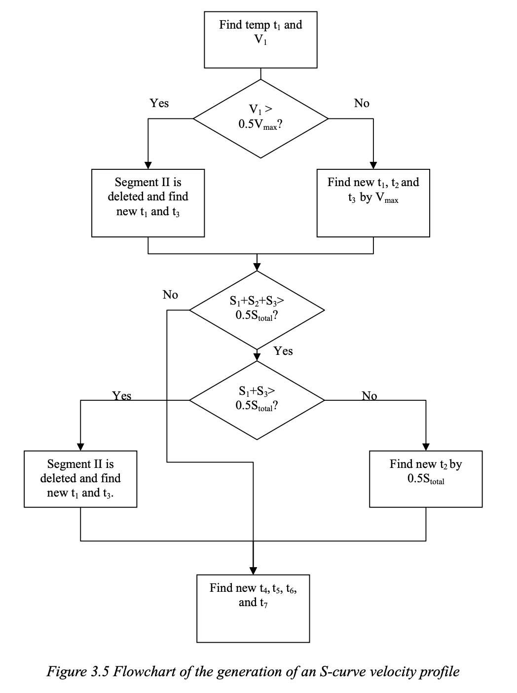
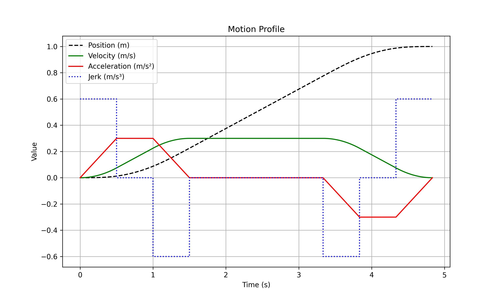
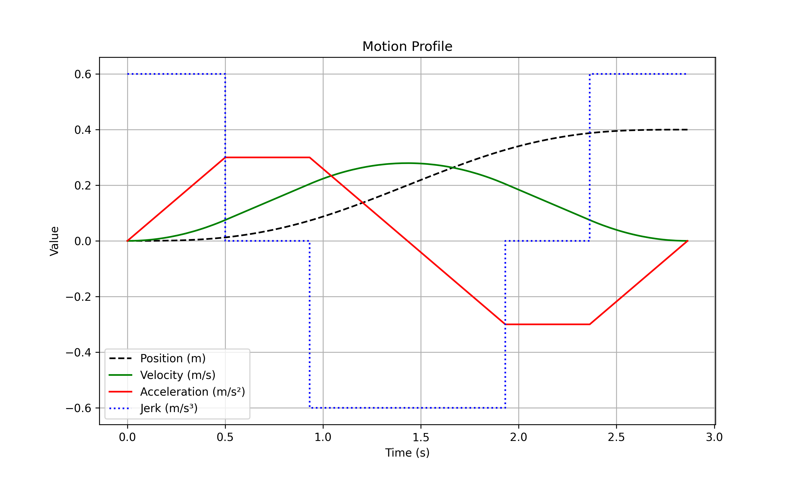
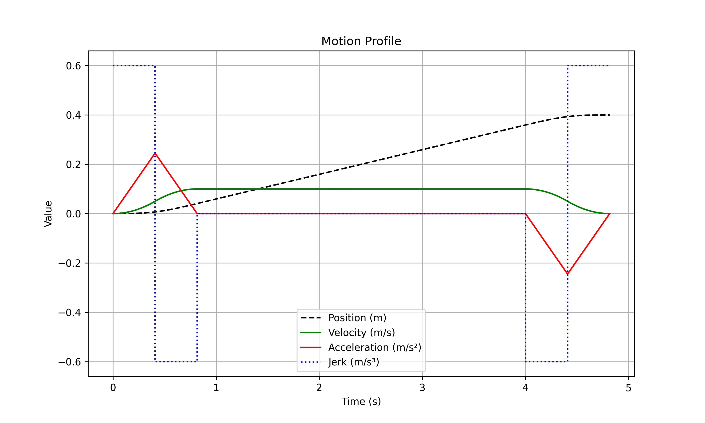
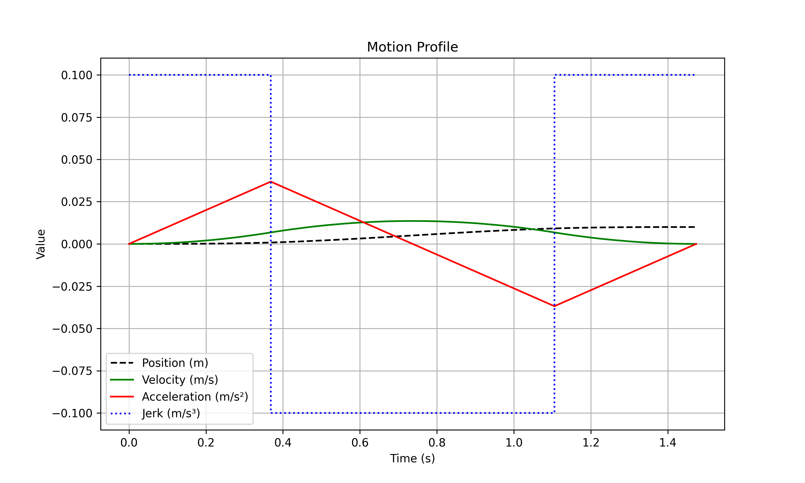

# Velocity Profile Calculator — limited jerk 1D motion

Main takes 4 parameters: 

- displacement expected;
- velocity limit; 
- acceleration limit; 
- jerk limit.

From the parameters ```calculate_time_1d()``` then calculates time of each of the 7 constant jerk segments to arrive at a continuous acceleration curve for movement, also known as **S-curve**.

The time results can generate a **csv** with all motion profile curves using ```generate_curve_1d()```, to be visualized with the Python script ```Plot.py```.

#### Requirements:
1. GCC
2. Python3 with Matplotlib and Pandas installed

## Flow chart:


## Compile:
```
>> gcc main.c -o main.o  -std=c99 -Wall -pedantic
```

## Run:
```main.o``` takes 4 arguments, displacent, maximum velocity, maximum acceleration and maximum jerk:
```
>> ./main.o  0.5 0.3 0.3 0.6 && python plot.py                  

Displacement is       0.500000 m   
Velocity limit        0.300000 m/s 
Acceleration limit is 0.300000 m/s2
Jerk limit is         0.600000 m/s3

Start calculate_time_1d(): 
time[0] = 0.500000 
velocity1 = 0.075000

velocity1 = 0.075000 
velocity2 = 0.225000 
velocity3 = 0.300000 

S1+S2+S3 = 0.012500+0.075000+0.137500 = 0.225000 
S4 = 0.050000 
velocity4 = 0.000000 


Time  0: 0.500000 s
Time  1: 0.500000 s
Time  2: 0.500000 s
Time  3: 0.166667 s
Time  4: 0.500000 s
Time  5: 0.500000 s
Time  6: 0.500000 s

Total time is 3.166667
File output.csv generated.
```



## Tests

To cover 100% of the code, 4 different inputs are required based on the flow chart.
The tests may be executed with ```./test.sh``` or manually.
### 01 — Maximum Velocity (V₁ ≤ V<sub>max</sub>/2)
```
>> ./main.o  1 0.3 0.3 0.6 && python plot.py
```

### 02 — Limited Velocity (V₁ > V<sub>max</sub>/2)
```
>> ./main.o  0.4 0.3 0.3 0.6 && python plot.py
```

### 03 — Limited Velocity (S1 + S2 + S3 > S/2)
```
>> ./main.o  0.4 0.1 0.3 0.6 && python plot.py
```

### 04 — Limited Acceleration (S1 + S3 > S/2)
```
>> ./main.o  0.01 0.166 0.5 0.1 && python plot.py
```

## REFERENCE

Ng Yu Ki (2008). "A New Velocity Profile Generation for High-Efficiency CNC Machining Applications."